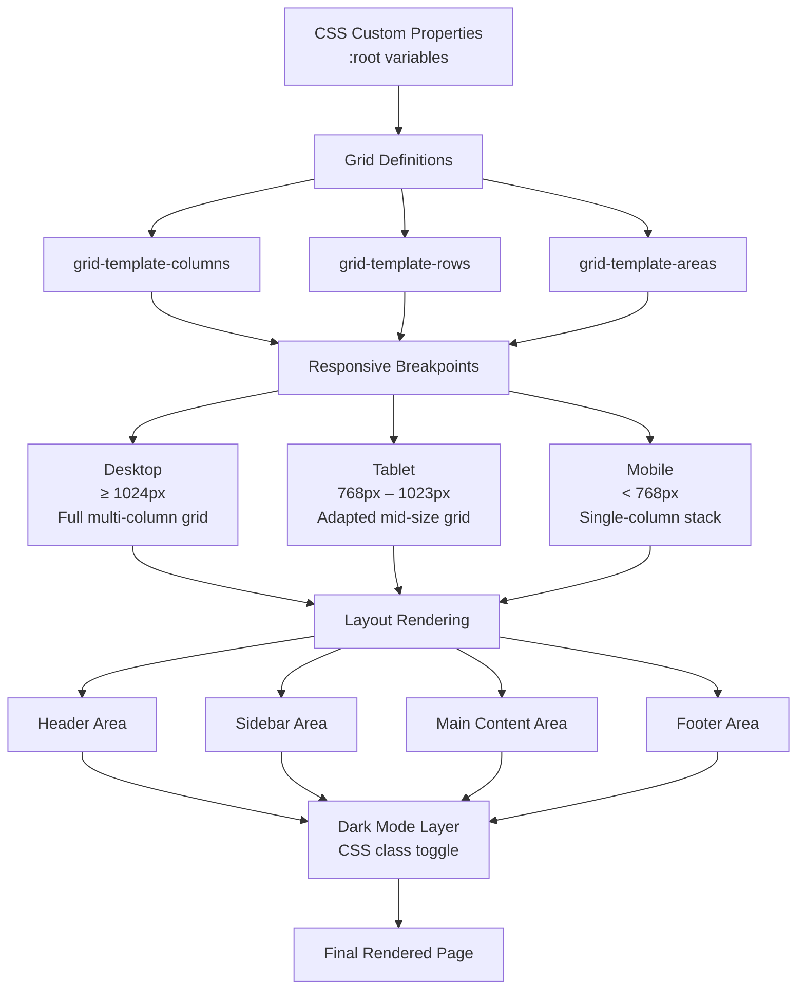
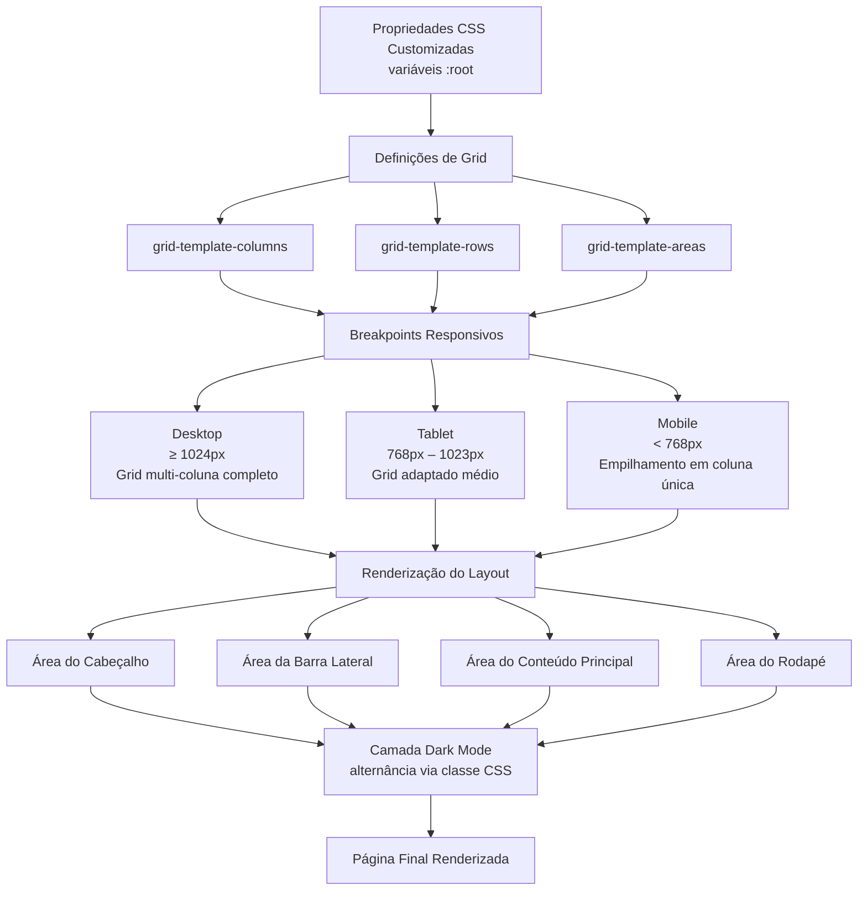

# Advanced-Grid-Layout-System

<div align="center">


</div>

## English

### 🚀 Overview

This project, **Advanced-Grid-Layout-System**, developed by Gabriel Demetrios Lafis, showcases a professional and highly responsive CSS Grid layout system. It is designed to demonstrate advanced CSS development skills, clean code architecture, and adherence to industry-standard best practices. The system is built to handle complex layouts with responsive breakpoints, ensuring optimal viewing across various devices.

### 🛠️ Technology Stack

| Technology    | Description                                       |
| :------------ | :------------------------------------------------ |
| **CSS3**      | Core styling language, leveraging modern features |
| **CSS Grid**  | Advanced layout module for two-dimensional grids  |
| **HTML5**     | Standard markup language for structuring content  |
| **JavaScript**| Enhances interactivity and dynamic content        |

### ⚡ Features

*   **Professional Code Architecture**: Organized and maintainable codebase following best practices.
*   **Modern Development Practices**: Utilizes contemporary CSS and HTML techniques.
*   **Responsive Design**: Adapts seamlessly to different screen sizes and devices.
*   **Dark Mode Support**: User-friendly dark mode implementation for improved accessibility and aesthetics.
*   **Interactive Elements**: Includes dynamic components for enhanced user experience.
*   **Well-Documented Codebase**: Clear and concise comments for easy understanding and future maintenance.
*   **Unit Testing**: Comprehensive unit tests ensure code reliability and functionality.

### 🏃‍♂️ Quick Start

To get a local copy up and running, follow these simple steps.

1.  **Clone the repository**:
    ```bash
    git clone https://github.com/galafis/Advanced-Grid-Layout-System.git
    ```
2.  **Navigate to the project directory**:
    ```bash
    cd Advanced-Grid-Layout-System
    ```
3.  **Open the demo in your browser**:
    ```bash
    # Open src/index.html directly in your web browser
    # or serve it using a local server, for example:
    python -m http.server 8000
    # Then visit http://localhost:8000 in your browser
    ```

### 🎯 Use Cases

*   **Professional Development Portfolio**: An excellent example of advanced front-end development skills.
*   **Learning Modern CSS Practices**: A practical resource for understanding CSS Grid and responsive design.
*   **Code Reference and Examples**: Provides clear, functional examples for various layout challenges.
*   **Enterprise-Grade Implementations**: Demonstrates scalable and robust design principles.

### 📊 Project Structure

```
Advanced-Grid-Layout-System/
├── .github/                 # GitHub specific configurations (e.g., workflows)
├── assets/                  # Images and other media assets
├── docs/                    # Project documentation (e.g., detailed README)
├── public/                  # Files for GitHub Pages deployment
├── src/                     # Source code (HTML, CSS, JS)
│   ├── index.html
│   ├── styles.css
│   └── script.js
├── tests/                   # Unit tests
│   ├── test.js
│   └── jest.setup.js
├── .gitignore               # Specifies intentionally untracked files to ignore
├── LICENSE                  # Project license
├── README.md                # Main project README
├── package.json             # Node.js project metadata and dependencies
├── package-lock.json        # Records the exact versions of dependencies
└── jest.config.js           # Jest test runner configuration
```

### 📈 Architecture Diagram




### 🤝 Contributing

Contributions are welcome! If you have suggestions for improvements or new features, please feel free to submit a Pull Request or open an Issue. For major changes, please open an issue first to discuss what you would like to change.

### 📄 License

This project is licensed under the MIT License - see the `LICENSE` file for details.

### 👨‍💻 Author

**Gabriel Demetrios Lafis**

*   Data Scientist & Engineer
*   Systems Developer & Analyst
*   Cybersecurity Specialist

⭐ **If this project was helpful to you, please consider giving it a star!**

---

## Português

### 🚀 Visão Geral

Este projeto, **Advanced-Grid-Layout-System**, desenvolvido por Gabriel Demetrios Lafis, apresenta um sistema de layout CSS Grid profissional e altamente responsivo. Ele foi projetado para demonstrar habilidades avançadas de desenvolvimento CSS, arquitetura de código limpo e adesão às melhores práticas padrão da indústria. O sistema é construído para lidar com layouts complexos com pontos de interrupção responsivos, garantindo visualização ideal em vários dispositivos.

### 🛠️ Stack Tecnológica

| Tecnologia    | Descrição                                         |
| :------------ | :------------------------------------------------ |
| **CSS3**      | Linguagem de estilo principal, utilizando recursos modernos |
| **CSS Grid**  | Módulo de layout avançado para grades bidimensionais |
| **HTML5**     | Linguagem de marcação padrão para estruturar conteúdo |
| **JavaScript**| Aumenta a interatividade e o conteúdo dinâmico    |

### ⚡ Funcionalidades

*   **Arquitetura de Código Profissional**: Base de código organizada e de fácil manutenção, seguindo as melhores práticas.
*   **Práticas Modernas de Desenvolvimento**: Utiliza técnicas contemporâneas de CSS e HTML.
*   **Design Responsivo**: Adapta-se perfeitamente a diferentes tamanhos de tela e dispositivos.
*   **Suporte a Modo Escuro**: Implementação de modo escuro amigável ao usuário para melhor acessibilidade e estética.
*   **Elementos Interativos**: Inclui componentes dinâmicos para uma experiência de usuário aprimorada.
*   **Base de Código Bem Documentada**: Comentários claros e concisos para fácil compreensão e manutenção futura.
*   **Testes Unitários**: Testes unitários abrangentes garantem a confiabilidade e funcionalidade do código.

### 🏃‍♂️ Início Rápido

Para ter uma cópia local e funcionando, siga estes passos simples.

1.  **Clone o repositório**:
    ```bash
    git clone https://github.com/galafis/Advanced-Grid-Layout-System.git
    ```
2.  **Navegue até o diretório do projeto**:
    ```bash
    cd Advanced-Grid-Layout-System
    ```
3.  **Abra a demonstração no seu navegador**:
    ```bash
    # Abra src/index.html diretamente no seu navegador web
    # ou sirva-o usando um servidor local, por exemplo:
    python -m http.server 8000
    # Em seguida, visite http://localhost:8000 no seu navegador
    ```

### 🎯 Casos de Uso

*   **Portfólio de Desenvolvimento Profissional**: Um excelente exemplo de habilidades avançadas de desenvolvimento front-end.
*   **Aprendizado de Práticas Modernas de CSS**: Um recurso prático para entender CSS Grid e design responsivo.
*   **Referência de Código e Exemplos**: Fornece exemplos claros e funcionais para vários desafios de layout.
*   **Implementações de Nível Empresarial**: Demonstra princípios de design escaláveis e robustos.

### 📊 Estrutura do Projeto

```
Advanced-Grid-Layout-System/
├── .github/                 # Configurações específicas do GitHub (ex: workflows)
├── assets/                  # Imagens e outros recursos de mídia
├── docs/                    # Documentação do projeto (ex: README detalhado)
├── public/                  # Arquivos para implantação do GitHub Pages
├── src/                     # Código fonte (HTML, CSS, JS)
│   ├── index.html
│   ├── styles.css
│   └── script.js
├── tests/                   # Testes unitários
│   ├── test.js
│   └── jest.setup.js
├── .gitignore               # Especifica arquivos intencionalmente não rastreados a serem ignorados
├── LICENSE                  # Licença do projeto
├── README.md                # README principal do projeto
├── package.json             # Metadados e dependências do projeto Node.js
├── package-lock.json        # Registra as versões exatas das dependências
└── jest.config.js           # Configuração do Jest test runner
```
### 📈 Diagrama de Arquitetura




### 🤝 Contributingo

Contribuições são bem-vindas! Se você tiver sugestões de melhorias ou novos recursos, sinta-se à vontade para enviar um Pull Request ou abrir uma Issue. Para grandes mudanças, por favor, abra uma issue primeiro para discutir o que você gostaria de mudar.

### 📄 Licença

Este projeto está licenciado sob a Licença MIT - veja o arquivo `LICENSE` para detalhes.

### 👨‍💻 Autor

**Gabriel Demetrios Lafis**

*   Cientista e Engenheiro de Dados
*   Desenvolvedor e Analista de Sistemas
*   Especialista em Segurança Cibernética

⭐ **Se este projeto foi útil para você, por favor, considere dar uma estrela!**

